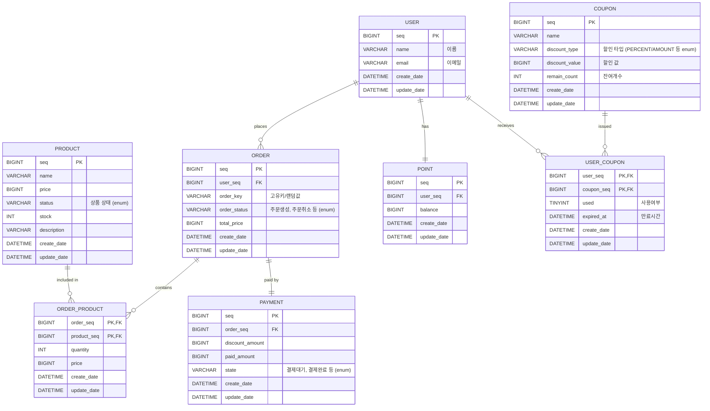

```mermaid
erDiagram
    PRODUCT {
        BIGINT seq PK
        VARCHAR name
        BIGINT price
        VARCHAR status  "상품 상태 (enum)"
        INT stock
        VARCHAR description
        DATETIME create_date
        DATETIME update_date
    }

    USER {
        BIGINT seq PK
        VARCHAR name  "이름"
        VARCHAR email "이메일"
        DATETIME create_date
        DATETIME update_date
    }

    POINT {
        BIGINT seq PK
        BIGINT user_seq FK
        BIGINT balance
        DATETIME create_date
        DATETIME update_date
    }

    COUPON {
        BIGINT seq PK
        VARCHAR name
        VARCHAR discount_type "할인 타입 (PERCENT/AMOUNT 등 enum)"
        BIGINT discount_value "할인 값"
        INT remain_count "잔여개수"
        DATETIME create_date
        DATETIME update_date
    }

    USER_COUPON {
        BIGINT user_seq PK,FK
        BIGINT coupon_seq PK,FK
        TINYINT used  "사용여부"
        DATETIME expired_at "만료시간"
        DATETIME create_date
        DATETIME update_date
    }

    ORDER {
        BIGINT seq PK
        BIGINT user_seq FK
        VARCHAR order_key "고유키/랜덤값"
        VARCHAR order_status "주문생성, 주문취소 등 (enum)"
        BIGINT total_price
        DATETIME create_date
        DATETIME update_date
    }

    ORDER_PRODUCT {
        BIGINT order_seq PK,FK
        BIGINT product_seq PK,FK
        INT quantity
        BIGINT price
        DATETIME create_date
        DATETIME update_date
    }

    PAYMENT {
        BIGINT seq PK
        BIGINT order_seq FK
        BIGINT discount_amount
        BIGINT paid_amount
        VARCHAR state "결제대기, 결제완료 등 (enum)"
        DATETIME create_date
        DATETIME update_date
    }

    %% Relationships
    USER ||--o{ ORDER : "places"
    ORDER ||--o{ ORDER_PRODUCT : "contains"
    PRODUCT ||--o{ ORDER_PRODUCT : "included in"
    ORDER ||--|| PAYMENT : "paid by"
    USER ||--|| POINT : "has"
    COUPON ||--o{ USER_COUPON : "issued"
    USER ||--o{ USER_COUPON : "receives"
    
```