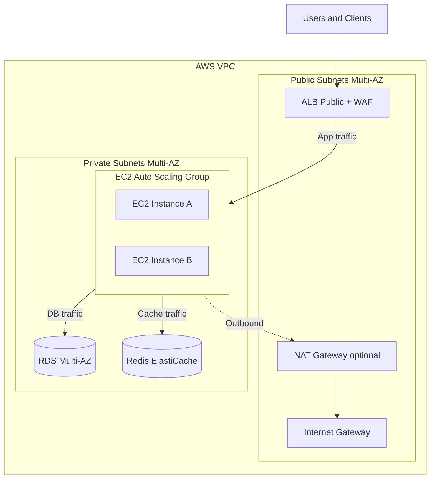

```mermaid
flowchart TB
    U[Users and Clients] --> ALB_Public

    subgraph VPC[AWS VPC]
        direction TB

        subgraph PUB[Public Subnets Multi-AZ]
            direction TB
            ALB_Public[ALB Public + WAF]
            IGW[Internet Gateway]
            NAT[NAT Gateway optional]
        end

        subgraph PRI[Private Subnets Multi-AZ]
            direction TB

            subgraph ASG[EC2 Auto Scaling Group]
                direction LR
                EC2A[EC2 Instance A]
                EC2B[EC2 Instance B]
            end

            RDS[(RDS Multi-AZ)]
            REDIS[(Redis ElastiCache)]
        end

        ALB_Public -->|App traffic| ASG
        ASG -->|DB traffic| RDS
        ASG -->|Cache traffic| REDIS

        ASG -.->|Outbound| NAT
        NAT --> IGW
    end
```